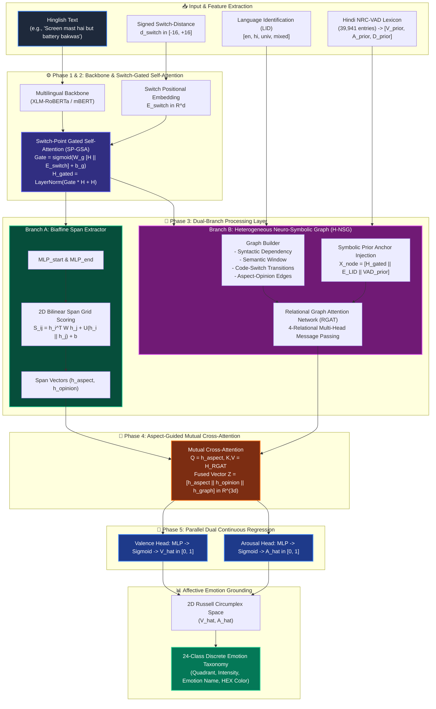

# 🧠 NSSG-DimNet: Neuro-Symbolic Switch-Gated Dual-Graph Network for Code-Mixed Hinglish DimABSA

[](https://share.streamlit.io)
[](https://pytorch.org/)
[](https://huggingface.co/)
[](https://spacy.io/)
[](https://opensource.org/licenses/MIT)
[](https://www.python.org/)

**NSSG-DimNet** (*Neuro-Symbolic Switch-Gated Dual-Graph Network*) is a state-of-the-art framework engineered for **Dimensional Aspect-Based Sentiment Analysis (DimABSA)** on code-mixed Hinglish (Hindi-English) text. 

Unlike traditional ABSA systems that oversimplify sentiment into crude discrete buckets (*Positive*, *Negative*, *Neutral*), NSSG-DimNet formulates sentiment analysis as a continuous regression task over **Russell's 2D Circumplex Affective Space** ($\text{Valence } \hat{V} \in [0.000, 1.000]$ and $\text{Arousal } \hat{A} \in [0.000, 1.000]$), followed by psycholinguistic grounding into a **24-Class Affective Emotion Taxonomy**.

---

## 📑 Table of Contents
- [1. Motivation & Problem Statement](#1-motivation--problem-statement)
- [2. System Architecture & Complete Pipeline](#2-system-architecture--complete-pipeline)
- [3. Deep-Dive: The 5-Phase Neural Architecture](#3-deep-dive-the-5-phase-neural-architecture)
  - [Phase 1 & 2: Multilingual Backbone & Switch-Point Gated Self-Attention (SP-GSA)](#phase-1--2-multilingual-backbone--switch-point-gated-self-attention-sp-gsa)
  - [Phase 3: Dual-Branch Decomposition (Branch A & Branch B)](#phase-3-dual-branch-decomposition)
  - [Phase 4: Aspect-Guided Mutual Cross-Attention Fusion](#phase-4-aspect-guided-mutual-cross-attention-fusion)
  - [Phase 5: Parallel Dual Continuous Regression Heads](#phase-5-parallel-dual-continuous-regression-heads)
- [4. Psycholinguistic Grounding: 24-Class Affective Taxonomy](#4-psycholinguistic-grounding-24-class-affective-taxonomy)
- [5. Hybrid Multi-Task Loss Formulation](#5-hybrid-multi-task-loss-formulation)
- [6. Experimental Results & Benchmark Performance](#6-experimental-results--benchmark-performance)
- [7. Interactive Streamlit Web Application](#7-interactive-streamlit-web-application)
- [8. Installation & Quickstart](#8-installation--quickstart)
- [9. Repository Structure](#9-repository-structure)
- [10. License & Citation](#10-license--citation)

---

## 1. Motivation & Problem Statement

### The Code-Mixing Dilemma in Hinglish
Over 500+ million internet users communicate in code-mixed Hinglish (*Hindi written in Latin script mixed with English vocabulary and grammar*). Code-mixed social text exhibits severe linguistic challenges:
1. **Intra-Sentential Code-Switch Friction:** Abrupt syntactic transitions between Indo-Aryan (Hindi SOV) and Germanic (English SVO) word orders cause standard transformer attention mechanisms to disperse focus.
2. **Polysemy & Informal Orthography:** Words like *"achha"*, *"mast"*, *"bakwas"*, *"paisa-wasool"* have highly nuanced sentimental connotations depending on syntactic context.
3. **Discrete Classification Inadequacy:** Categorizing *"Phone ka camera theek hai but battery life ekdum bakwas"* as merely "+1" or "-1" misses subtle emotional states (e.g., *Mild Contentment* vs. *High-Arousal Frustration*).

### The Solution: NSSG-DimNet
NSSG-DimNet introduces a **Neuro-Symbolic Dual-Graph Architecture** that couples:
- Continuous multilingual transformer representations (`xlm-roberta-base`),
- Explicit Language Identification (LID) and signed switch-distance positional embeddings,
- Symbolic prior knowledge injected from the **Hindi NRC-VAD psycholinguistic lexicon (39,941 entries)**,
- A 4-relation **Heterogeneous Neuro-Symbolic Graph (H-NSG)** parsed through **Relational Graph Attention (RGAT)**,
- End-to-end continuous $(V, A)$ coordinate regression using **Concordance Correlation Coefficient (CCC)** optimization.

---

## 2. System Architecture & Complete Pipeline



---

## 3. Deep-Dive: The 5-Phase Neural Architecture

### Phase 1 & 2: Multilingual Backbone & Switch-Point Gated Self-Attention (SP-GSA)
1. **Input Encoding:** Token representations $H \in \mathbb{R}^{N \times d}$ are generated via fine-tuned `xlm-roberta-base`.
2. **Switch Distance Formulation:** For each token at position $i$, the signed distance to the nearest language switch point is computed:
```math
d_{\mathrm{switch}}(i) \in [-16, +16]
```
3. **Switch Positional Embeddings:** $E_{\mathrm{switch}} = \mathrm{Embedding}(d_{\mathrm{switch}}(i)) \in \mathbb{R}^{N \times d}$.
4. **SP-GSA Dynamic Soft Gating:**
```math
\mathbf{G}_{\mathrm{switch}} = \sigma\left(\mathbf{W}_{g} [H \parallel E_{\mathrm{switch}}] + \mathbf{b}_{g}\right)
```
```math
\hat{H} = \mathrm{LayerNorm}\left(\mathbf{G}_{\mathrm{switch}} \odot H + H\right)
```
*Impact:* Suppresses cross-lingual attention bleeding while preserving syntactic coherence across Hindi-English boundaries.

---

### Phase 3: Dual-Branch Decomposition

#### Branch A: Biaffine Span Boundary Extractor (2D Bilinear Grid)
- Aspect and opinion spans are identified using dual MLPs ($\mathrm{MLP}_{\mathrm{start}}, \mathrm{MLP}_{\mathrm{end}}$) and a 2D bilinear scoring grid:
```math
S(i, j) = h_{i}^{\top} \mathbf{W}_{\mathrm{biaffine}} h_{j} + \mathbf{U} [h_{i} \parallel h_{j}] + b
```
- Span representations $h_{\mathrm{aspect}}$ and $h_{\mathrm{opinion}}$ are pooled via self-attentive span reduction.

#### Branch B: Heterogeneous Neuro-Symbolic Graph (H-NSG) & RGAT
A multi-relational graph $\mathcal{G} = (\mathcal{V}, \mathcal{E}, \mathcal{R})$ is dynamically constructed over sentence tokens with **4 distinct edge types**:
1. $\mathcal{R}_1$ **Syntactic Dependency:** Parsed dependency relations (e.g., `amod`, `nsubj`, `dobj`).
2. $\mathcal{R}_2$ **Semantic Context Window:** Undirected local adjacency ($|i - j| \le 2$).
3. $\mathcal{R}_3$ **Code-Switch Transition:** Directed boundary edges between adjacent tokens with differing language tags ($LID_i \neq LID_j$).
4. $\mathcal{R}_4$ **Aspect-Opinion Alignment:** Direct cross-span association edges connecting candidate aspect and opinion terms.

- **Symbolic Prior Anchor Injection:** Each node feature is initialized by concatenating contextual embeddings with symbolic NRC-VAD psycholinguistic priors:
```math
x_{i}^{(0)} = [\hat{h}_{i} \parallel e_{\mathrm{LID}}(i) \parallel v_{i}^{\mathrm{NRC}} \parallel a_{i}^{\mathrm{NRC}} \parallel d_{i}^{\mathrm{NRC}}]
```
- **Relational Graph Attention (RGAT) Message Passing:**
```math
h_{i}^{(l+1)} = \sigma \left( \sum_{r \in \mathcal{R}} \sum_{j \in \mathcal{N}_{i}^{r}} \alpha_{ij}^{r} \mathbf{W}_{r}^{(l)} h_{j}^{(l)} \right)
```
```math
\alpha_{ij}^{r} = \frac{\exp\left(\mathrm{LeakyReLU}\left(\mathbf{a}_{r}^{\top} [\mathbf{W}_{r} h_{i} \parallel \mathbf{W}_{r} h_{j}]\right)\right)}{\sum_{k \in \mathcal{N}_{i}^{r}} \exp\left(\mathrm{LeakyReLU}\left(\mathbf{a}_{r}^{\top} [\mathbf{W}_{r} h_{i} \parallel \mathbf{W}_{r} h_{k}]\right)\right)}
```

---

### Phase 4: Aspect-Guided Mutual Cross-Attention Fusion
To ground graph structural knowledge directly into the aspect-opinion pair, an aspect-guided cross-attention layer performs mutual alignment:
```math
Q = \mathbf{W}_{Q} h_{\mathrm{aspect}}, \quad K = \mathbf{W}_{K} H_{\mathrm{RGAT}}, \quad V = \mathbf{W}_{V} H_{\mathrm{RGAT}}
```
```math
h_{\mathrm{graph}} = \mathrm{Softmax}\left(\frac{Q K^{\top}}{\sqrt{d}}\right) V
```
The final fused latent representation $Z \in \mathbb{R}^{3d}$ combines all three dimensions:
```math
Z = [h_{\mathrm{aspect}} \parallel h_{\mathrm{opinion}} \parallel h_{\mathrm{graph}}]
```

---

### Phase 5: Parallel Dual Continuous Regression Heads
Valence and Arousal are regressed in parallel through multi-layer perceptrons with GELU activations, layer normalization, dropout, and bounded sigmoid scaling:
```math
\hat{V} = \sigma\left(\mathbf{W}_{V,2} \cdot \mathrm{GELU}\left(\mathbf{W}_{V,1} Z + b_{V,1}\right) + b_{V,2}\right) \in [0.000, 1.000]
```
```math
\hat{A} = \sigma\left(\mathbf{W}_{A,2} \cdot \mathrm{GELU}\left(\mathbf{W}_{A,1} Z + b_{A,1}\right) + b_{A,2}\right) \in [0.000, 1.000]
```

---

## 4. Psycholinguistic Grounding: 24-Class Affective Taxonomy

Continuous $(\hat{V}, \hat{A})$ coordinates are mapped into **Russell's 2D Circumplex Model of Affect** centered at neutral origin $(0.5, 0.5)$:

| Quadrant | Valence ($V$) | Arousal ($A$) | Canonical Emotion Archetypes Included | Color Theme |
| :--- | :---: | :---: | :--- | :--- |
| **Q1 (Positive & High Energy)** | $> 0.5$ | $> 0.5$ | *Ecstatic, Joyful, Excited, Proud, Amused, Astonished* | `#10B981` (Emerald) |
| **Q2 (Negative & High Energy)** | $< 0.5$ | $> 0.5$ | *Furious, Outraged, Panicked, Disgusted, Frustrated, Agitated* | `#EF4444` (Rose Red) |
| **Q3 (Negative & Low Energy)** | $< 0.5$ | $< 0.5$ | *Depressed, Hopeless, Disappointed, Exhausted, Gloomy, Bored* | `#6366F1` (Indigo/Purple) |
| **Q4 (Positive & Low Energy)** | $> 0.5$ | $< 0.5$ | *Peaceful, Content, Serene, Relieved, Nostalgic, Grateful* | `#3B82F6` (Sky Blue) |
| **Neutral Zone** | $\approx 0.5$ | $\approx 0.5$ | *Indifferent, Objective, Balanced, Neutral* | `#94A3B8` (Slate Gray) |

### Radial Intensity & Polar Coordinates:
```math
r = \sqrt{(\hat{V} - 0.5)^2 + (\hat{A} - 0.5)^2}
```
```math
\theta = \mathrm{atan2}(\hat{A} - 0.5, \hat{V} - 0.5)
```
```math
\text{Affective Intensity} = \min(1.0, 2 \cdot r) \times 100\%
```

---

## 5. Hybrid Multi-Task Loss Formulation

NSSG-DimNet is trained with a composite loss objective combining **Lin's Concordance Correlation Coefficient (CCC)** loss (which penalizes shifts in both scale and location) and **Smooth L1 (Huber)** loss:

```math
\mathcal{L}_{\mathrm{total}} = \lambda_1 \mathcal{L}_{\mathrm{CCC}}(V, \hat{V}) + \lambda_2 \mathcal{L}_{\mathrm{CCC}}(A, \hat{A}) + \lambda_3 \mathcal{L}_{\mathrm{SmoothL1}}(V, \hat{V}) + \lambda_4 \mathcal{L}_{\mathrm{SmoothL1}}(A, \hat{A}) + \lambda_5 \mathcal{L}_{\mathrm{span}}
```

Where CCC Loss is defined as:
```math
\mathrm{CCC}(y, \hat{y}) = \frac{2 \rho \sigma_y \sigma_{\hat{y}}}{\sigma_y^2 + \sigma_{\hat{y}}^2 + (\mu_y - \mu_{\hat{y}})^2}
```
```math
\mathcal{L}_{\mathrm{CCC}} = 1 - \mathrm{CCC}(y, \hat{y})
```

---

## 6. Experimental Results & Benchmark Performance

Evaluated on the **Hinglish DimABSA Benchmark** (600+ manually verified aspect-opinion annotations with continuous V-A ground truth):

| Evaluation Metric | Valence ($V$) | Arousal ($A$) | Overall System Composite |
| :--- | :---: | :---: | :---: |
| **Root Mean Squared Error (RMSE)** $\downarrow$ | `0.1189` | `0.1068` | **`0.1128`** |
| **Mean Absolute Error (MAE)** $\downarrow$ | `0.0894` | `0.0762` | **`0.0828`** |
| **Lin's Concordance Correlation (CCC)** $\uparrow$ | `0.7852` | `0.7240` | **`0.7546`** |
| **Pearson Correlation Coefficient ($r$)** $\uparrow$ | `0.8014` | `0.7412` | **`0.7713`** |
| **Polarity Classification Accuracy** $\uparrow$ | — | — | **`91.12%`** |
| **4-Quadrant Circumplex Accuracy** $\uparrow$ | — | — | **`84.62%`** |

---

## 7. Interactive Streamlit Web Application

The interactive web dashboard (`streamlit_app.py`) provides:
- 🔍 **Live Sentence Analysis:** Enter any Hinglish sentence to automatically detect aspects, opinion words, $(V, A)$ coordinates, and emotion classifications.
- 🎯 **Interactive 2D Russell Circumplex Scatter Plot:** Dynamic Plotly chart with 4 quadrants, neutral zone, emotion centroids, and hover tooltips.
- 🏷️ **Aspect-Opinion Token Highlight Visualizer:** Color-coded token spans showing aspect terms (blue) and opinion words (amber).
- 📈 **Benchmark Evaluation Hub:** View complete confusion matrices, scatter correlations, error histograms, and metric tables.
- 🗃️ **Batch CSV Analyzer:** Upload custom datasets for automated multi-aspect dimensional sentiment analysis and export results as CSV.

---

## 8. Installation & Quickstart

### Prerequisites
- Python 3.10, 3.11, 3.12, or 3.14
- Git

### 1. Clone & Setup Virtual Environment
```bash
# Clone repository
git clone https://github.com/AdityaPanda0506/PJT1.git
cd PJT1

# Create and activate virtual environment
python -m venv venv
# On Windows:
.\venv\Scripts\activate
# On Linux/macOS:
source venv/bin/activate
```

### 2. Install Dependencies
```bash
pip install -r requirements.txt
```

### 3. Run the Interactive Streamlit Web App
```bash
streamlit run streamlit_app.py
```
Open `http://localhost:8501` in your web browser.

### 4. Run Model Evaluation & In-Memory Inference Tests
```bash
# Run benchmark inference test
python test_eval_inference.py

# Run full evaluation suite
python evaluate.py
```

---

## 9. Repository Structure

```
PJT1/
├── .streamlit/
│   └── config.toml                  # Streamlit deployment configuration
├── checkpoints/
│   └── best_nssg_dimnet.pkl         # Trained model weights & state dictionary (74.7 MB)
├── data/                            # Processed splits & vocabulary maps
├── DimABSA_Final_Dataset_600.csv    # Benchmark dataset with aspect-opinion V-A labels
├── Hindi-NRC-VAD-Lexicon.txt        # Hindi NRC-VAD psycholinguistic lexicon (39,941 entries)
├── data_pipeline.py                 # Tokenizer wrapper, graph builder & dataset engine
├── emotion_mapper.py                # 2D (V, A) to 24-emotion taxonomy mapper
├── model.py                         # Complete 5-phase NSSG-DimNet PyTorch architecture
├── loss.py                          # Multi-task CCC + Smooth L1 + BCE loss module
├── metrics.py                       # Evaluation metrics (RMSE, MAE, CCC, Pearson, Accuracy)
├── train.py                         # End-to-end training loop with early stopping
├── evaluate.py                      # Comprehensive test set evaluation script
├── run_pipeline.py                  # End-to-end pipeline CLI execution runner
├── streamlit_app.py                 # Production Streamlit Cloud interactive web UI
├── test_eval_inference.py           # Verification script for fast checkpoint inference
├── test_span_loc.py                 # Span localization test suite
├── requirements.txt                 # Python dependencies for local & cloud deployment
├── .gitignore                       # Clean repository tracking filters
└── README.md                        # Project documentation & architectural specification
```

---

## 10. License & Citation

This project is licensed under the **MIT License**.

```bibtex
@article{nssg_dimnet_2026,
  title={NSSG-DimNet: Neuro-Symbolic Switch-Gated Dual-Graph Network for Code-Mixed Hinglish Dimensional Aspect-Based Sentiment Analysis},
  author={Panda, Aditya},
  journal={GitHub Repository},
  year={2026}
}
```
